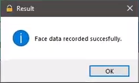

# Door lock Using Face Recognition
## Based on openCV python

\
This project was made to fulfill the final project of my Artificial Intelligence subject 
This code is based from krishnaik06's github (link below) and i made changes to fix something not correctly working and add simple GUI to operate.
Also i got the references from IqbalLx's github and youtube channel to understand the algorithm.

If you want to try this program, u'll need to install python and opencv library. Also create a folder named "faces data" to store training data  
and "faces" to store captured face inside the main folder (folder that contain all files).

thanks to krishnaik06 and IqbalLx, hence i can finish my final project.

krishnaik06's github : http://bit.ly/3ocCS0Y \
IqbalLx github : http://bit.ly/3ht8BZj \

Here are some documentation and [opencv algorithm explanation with program demo](https://drive.google.com/file/d/1Ud4Cd-cwyUcW3hD15QRSdbrSY2QaVThO/view?usp=sharing) in Bahasa.

\
\
